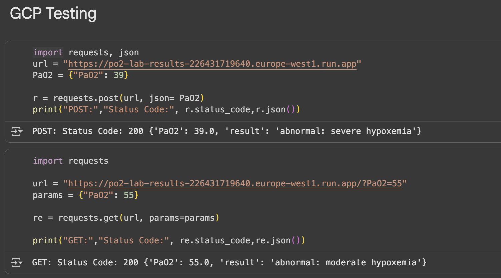
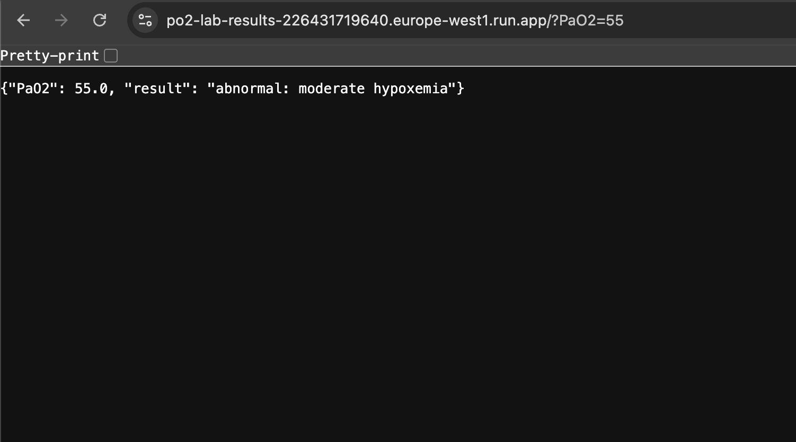
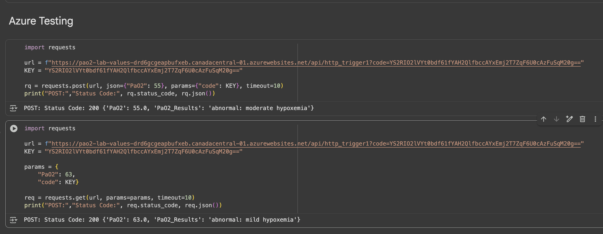
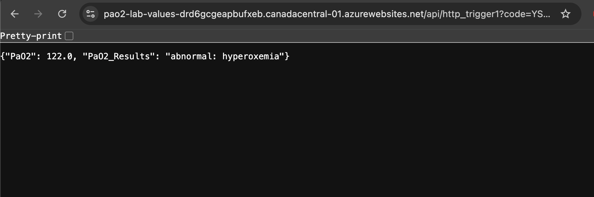

# GCP Serverless Cloud Function
## Lab Rules
I used the partial pressure of oxygen in the arterila blood(PaO2) as my lab value. The link below is my source and the chart that defines it. Anything that isn't normal(80 <= PaO2 <= 100) is labelled as abnormal.

Source: [PaO2 information](https://ecampusontario.pressbooks.pub/mechanicalventilators/chapter/oxygenation-status-the-final-piece/)

Below are my publicly accessible endpoint URLs for each deployed function.

## Clouds, Regions, Auth
Google Cloud Run: 

Region: Europe-west1

Auth:Unauthenticated(public)

[https://po2-lab-results-226431719640.europe-west1.run.app](https://po2-lab-results-226431719640.europe-west1.run.app)

Azure Function:

Region: Canada Central
Auth: Key Based 

URL:
[https://pao2-lab-values-drd6gcgeapbufxeb.canadacentral-01.azurewebsites.net/api/http_trigger1?code=YS2RIO2lVYt0bdf61fYAH2QlfbccAYxEmj2T7ZqF6U0cAzFuSqM20g==](https://pao2-lab-values-drd6gcgeapbufxeb.canadacentral-01.azurewebsites.net/api/http_trigger1?code=YS2RIO2lVYt0bdf61fYAH2QlfbccAYxEmj2T7ZqF6U0cAzFuSqM20g==)

***The Azure function requires a function key. For grading, the key is shared privately (not in the repo). URL will submitted on mycourses***

## GET/POST EXAMPLE REQUEST
#### GCP

#### Azure

## Loom URL Recording:

## Personal Comparison
Google Console was more intutive to use compared to Azure. Azure had more coding in order to produce the same results as Google. Azure's Url was also really long compared to Google. However, Google required me to deploy the source code before testing it, taking up a lot of time. Azure was able to test out the code without deployment.